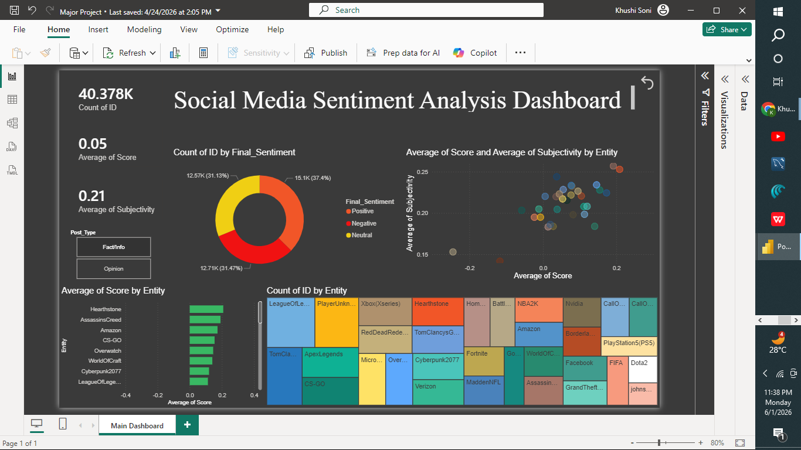

# 📊 Sentiment Analysis Dashboard (Power BI & Python)

An end-to-end data science and business intelligence project completed as part of my **Anudip Internship Major Project**. This project analyzes social media text data to classify user sentiment and visualizes key business metrics dynamically.

---

## 🔗 Live Dashboard Link
👉 **[https://alardcharitable-my.sharepoint.com/:u:/g/personal/khushi_soni_alarduniversity_edu_in/IQD1CkQ51Kv7QKMFdxnnbpURAatPoKTH29rKEyIrEhivj8A?e=8g8CsH]**

*(Note: If the live link is restricted by organization permissions, please download the `.pbix` file from this repository to view and interact with the dashboard locally on Power BI Desktop).*

---

## 🖼️ Dashboard Preview

---

## ⚙️ Project Workflow & Architecture

1. **Data Collection & Extraction**
   * Gathered raw sentiment text datasets (`twitter_training.csv` and `social_media_intelligence.csv`).
2. **Text Preprocessing & ML Modeling (Google Colab)**
   * Cleaned the text using Python (removing stopwords, punctuation, and tokenization).
   * Feature extraction and sentiment classification labeling (Positive, Negative, Neutral).
3. **BI Dashboard Visualization (Power BI)**
   * Imported the processed dataset into Power BI Desktop.
   * Wrote custom **DAX measures** to build dynamic KPIs and interactive cross-filtering charts.

---

## 📁 Repository Files
* `Major_Project.ipynb` - The complete Python machine learning training pipeline executed in Google Colab.
* `twitter_training.csv` / `social_media_intelligence.csv` - The raw and structured source datasets.
* Your_Dashboard_File.pbix - The original Power BI desktop file containing data models and visualization layouts.

## 🛠️ Tech Stack
* **Languages:** Python
* **Libraries:** Pandas, NumPy, Scikit-Learn, NLTK / Spacy
* **BI Platform:** Power BI Desktop, DAX
* **Environment:** Google Colab
